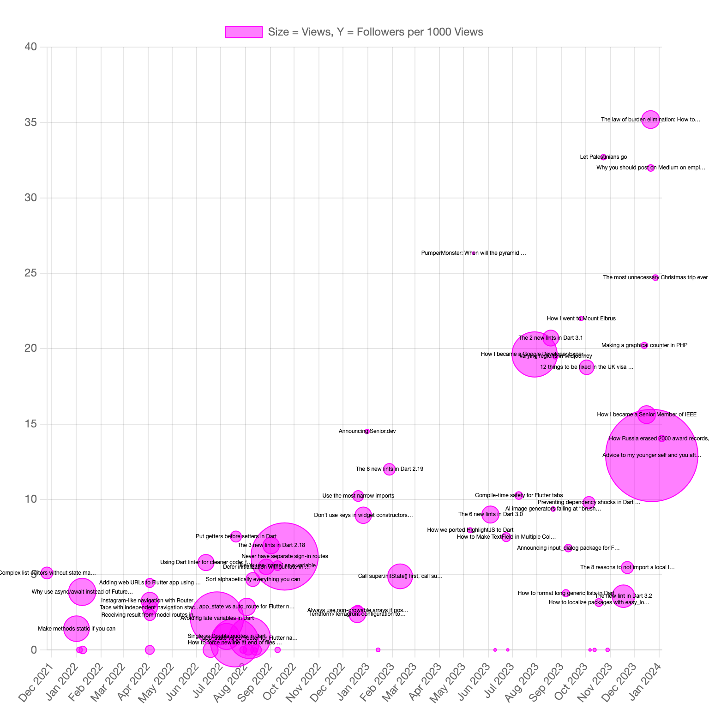
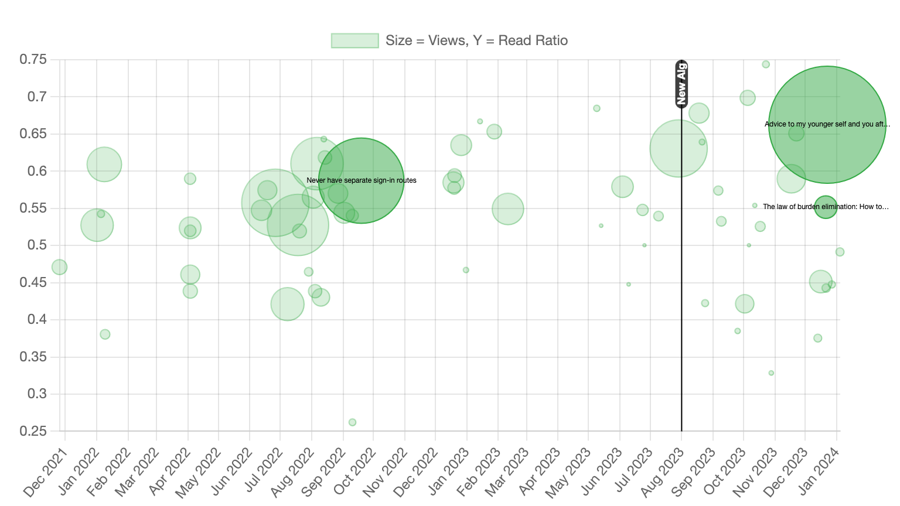
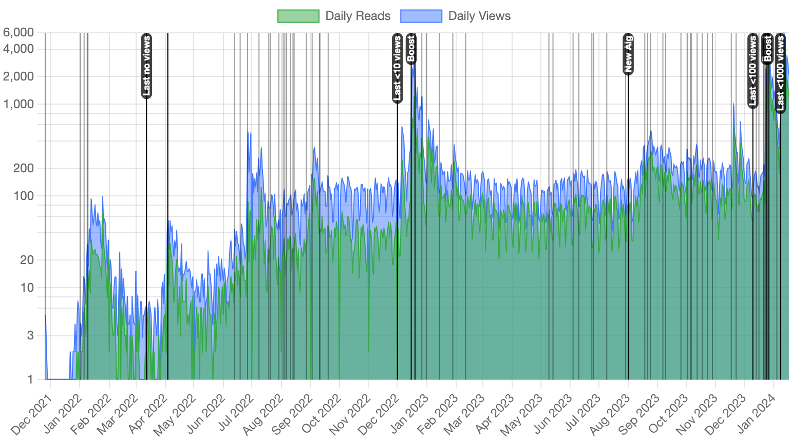

# js-medium-stat

This script plots your Medium statistics.

## Warning

This script uses the undocumented API, which the Medium frontend uses to access its backend.
Many services nowadays forbid any automation in accessing them on your end.
I have not found such restriction in [Medium's Terms of Service](https://policy.medium.com/medium-terms-of-service-9db0094a1e0f)
but they still may ban you for abusing the API.
Use this at your risk.

## Usage

1. Open any Medium page that has your username. For instance, https://medium.com/@alexey.inkin/followers
2. Press F12 to open Developer Tools of your browser.
3. Read the code carefully because you should never paste untrusted code in your browser console.
   Malicious code pasted that way can steal your access to the currently viewed website, and more.
4. Paste the content of [1_constants.js](1_constants.js) to the console and press Enter.
5. Paste the content of [2_functions.js](2_functions.js) to the console and press Enter.
6. From [3_load.js](3_load.js), copy the call of `loadAllFresh()` to the console and press Enter.
7. From [4_plot.js](4_plot.js), paste any lines to the console to plot specific charts you want.

Loading of each story's statistics takes a few minutes on my account with 60+ stories.
You can start plotting before it's complete.
Overall account data is quickly loaded before separate stories and can be plotted.
Bubble charts will show only the stories for which all statistics are loaded.

In the end, you should see in console:

```
All statistics are loaded.
```

## Cache

The script caches every request to Medium in
[IndexedDB](https://developer.mozilla.org/en-US/docs/Web/API/IndexedDB_API).
Some of that data will never expire:

- Account views and reads for past months (these statistics are requested per month).
- Each story's statistics for past years (these statistics are requested per year).

Other data is better updated everytime you want fresh charts.

When you open the console in your browser, there are few ways to initialize the script:

### Load all fresh data

This function loads all the data.
It uses cache for complete periods and fetches fresh data for incomplete periods.
Use this when you want the fresh data and to update the cache.

```js
await loadAllFresh();
```

### Load all data, accept incomplete cached periods

This function loads all the data.
On the first run, if nothing is cached, it behaves like the above.
Otherwise, for each piece of data it uses a cached copy if available
even if it is for an incomplete period.
For stories and periods with no cached data at all, fresh data is fetched.

In short, this is the function to resume fetching if it was interrupted for some reason
and to not re-request the current period data where it's cached.

```js
await loadAllCachedIncomplete();
```

### Load all data from cache only

This function loads all the data from cache only. No requests to Medium are made.
If anything is not cached, empty data is loaded for that metric:
no followers, no stories, or no views or anything for a story.
Use this for experiments to not consume the API quota at all.

```js
await loadAllCachedOnly();
```

## Chart Size

You can change the aspect ratio in [1_constants.js](1_constants.js)
by changing `width` and `height`. However, these are not the absolute size.

In my test, the absolute size is determined by the browser window.
You can get precise width by turing on "Responsive Design Mode" (Firefox) or "Device Toolbar" (Chrome),
there you can enter the desired screen width. The height will be derived from it.

On Mac, the downloaded charts are twice the width of the screen because of pixel scaling.
I haven't tried it on non-Mac.

## Custom Annotations

In [1_constants.js](1_constants.js), populate the `manualEvents` map.
It will produce vertical lines with the specified text on all overall charts.

For the charts for individual articles, pass the map to the plotting function.

## Gallery

### Followers Bubbles



In this chart, every story is a bubble:

- Horizontally: the date when the story was published.
- Bubble size: views of the story.
- Vertically: followers from the story per 1000 views.
  This is underestimation, because when someone navigates from the story to your profile and follows from there,
  they are not counted as a follower from this story.

Medium only counts followers per story since 2023.
For older stories, the bubbles show followers since 2023 per views since 2023.

```js
plotStoriesFollowersBubbles();
```

### Followers Bubbles, Highlight Specific Stories


```js
plotStoriesFollowersBubbles(['id1', 'id2', 'id3']);
```

### Read Ratio Bubbles


In this chart, every story is a bubble:
- Horizontally: the date when the story was published.
- Bubble size: views of the story.
- Vertically: read ratio of the story.

On August 1, 2023, Medium
[changed](https://medium.com/blog/new-partner-program-incentives-focus-on-high-quality-human-writing-7335f8557f6e)
the definition of "read".
Before it was a read till the end. After that date, it is a read for 30 seconds or more.

For the stories published since that date, bubbles show total reads over total views.
For older stories, the bubbles show reads since that date over views since that date.
This is so the bubbles before and after the date can be compared.

However, if an article was not viewed much since that date, the ratio may be heavily random
even for not small bubbles.

```js
plotStoriesReadRatioBubbles();
```

### Read Ratio Bubbles, Highlight Specific Stories



```js
plotStoriesFollowersBubbles(['id1', 'id2', 'id3']);
```

### Daily Views


This and other charts show:
- Each published article as a vertical bar without text label (darker than the grid).
- Each boosted article on the boost date.
- When you last had no views on a day, <10 views, <100 views, etc.
- Any custom labels can be added via `manualEvents` in [1_constants.js](1_constants.js).

```js
plotViews();
```

### Daily Views, Weekly Average


```js
plotViewsWeekAverage();
```

### Daily Reads


```js
plotReads();
```

### Daily Reads, Weekly Average


```js
plotReadsWeekAverage();
```

### Daily Views and Reads



```js
plotViewsAndReads();
```

### Daily Views and Reads, Weekly Average


```js
plotViewsAndReadsWeekAverage();
```

### Followers


```js
plotFollowers();
```

### Followers per 1000 Views


```js
plotFollowersPerView();
```

### Followers and Followers per 1000 Views


```js
plotFollowersAndPerView();
```

### Story Views


```js
plotStoryViews('story_id');
```
